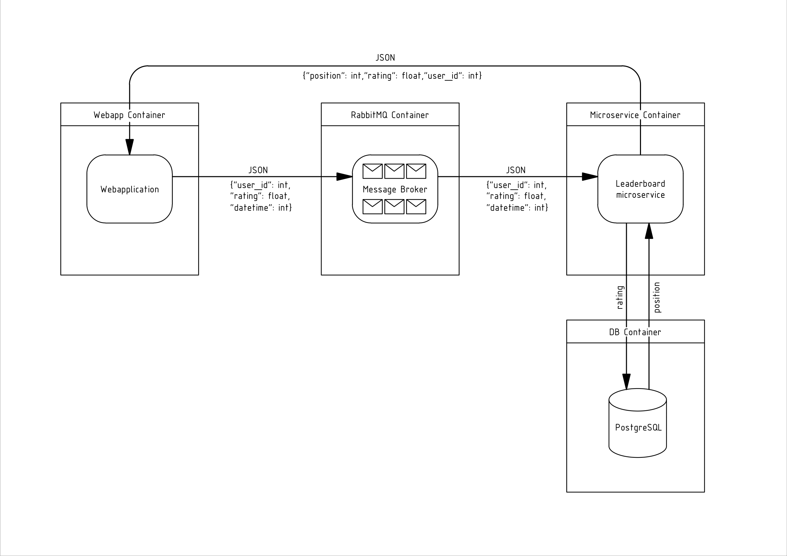

# Players leaderboard microservice.
## RabbitMQ, Django, PostgreSQL.
Microservice that builds leaderboards based on player rating. Information on the current ranking of players comes in AMQP.
 
Message to microservice comes in JSON: {“user_id”: int, “rating”: float, “datetime”: int<timestamp>}.
 
Leaderboard generated  by [Materialized View](https://postgrespro.ru/docs/postgrespro/9.5/rules-materializedviews) PostgreSQL (the higher the player’s rating, the
higher position in the leaderboard).
### Microservice architecture.

### Deployment instructions.
Deployment instructions can be found in [instructions](Instructions/deploy_instruction.pdf).